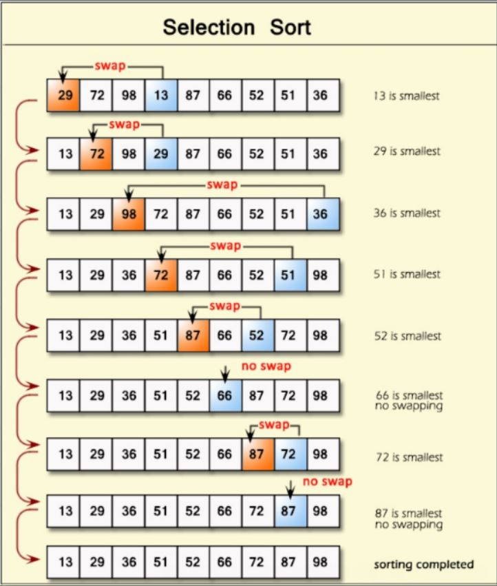

# Approach

## Main Logic

```python
for i in range(n - 1):
    min_index = i

    for j in range(i + 1, n):
        if arr[j] < arr[min_index]:
            min_index = j

    arr[i], arr[min_index] = arr[min_index], arr[i]
```

- Assume the first unsorted element is the minimum.
- Traverse the remaining unsorted part to find the actual minimum.
- Swap it with the first unsorted position.
- Repeat until the entire array becomes sorted.

**Remember:** After every pass, one element is placed in its correct sorted position.

---

## Flow



---

## Dry Run

### Example 1

**Input**

```text
arr = [6, 2, 8, 4, 10]
```

| Pass | Minimum Found | Swap | Array After Pass |
|------|---------------|------|------------------|
| Initial | - | - | `[6, 2, 8, 4, 10]` |
| 1 | `2` | `6 ↔ 2` | `[2, 6, 8, 4, 10]` |
| 2 | `4` | `6 ↔ 4` | `[2, 4, 8, 6, 10]` |
| 3 | `6` | `8 ↔ 6` | `[2, 4, 6, 8, 10]` |
| 4 | `8` | No swap needed | `[2, 4, 6, 8, 10]` |

**Output**

```text
[2, 4, 6, 8, 10]
```

---

### Example 2 (Sample Input 2 - Test Case 1)

**Input**

```text
arr = [1, 2]
```

| Pass | Minimum Found | Swap | Array After Pass |
|------|---------------|------|------------------|
| Initial | - | - | `[1, 2]` |
| 1 | `1` | No swap needed | `[1, 2]` |

**Output**

```text
[1, 2]
```

---

### Example 3 (Sample Input 2 - Test Case 2)

**Input**

```text
arr = [4, 3, 2, 1]
```

| Pass | Minimum Found | Swap | Array After Pass |
|------|---------------|------|------------------|
| Initial | - | - | `[4, 3, 2, 1]` |
| 1 | `1` | `4 ↔ 1` | `[1, 3, 2, 4]` |
| 2 | `2` | `3 ↔ 2` | `[1, 2, 3, 4]` |
| 3 | `3` | No swap needed | `[1, 2, 3, 4]` |

**Output**

```text
[1, 2, 3, 4]
```

---

## Complexity Analysis

- **Time Complexity:** `O(n²)` – For every position, we search the remaining array to find the minimum.
- **Space Complexity:** `O(1)` – Sorting is done in-place without using extra space.