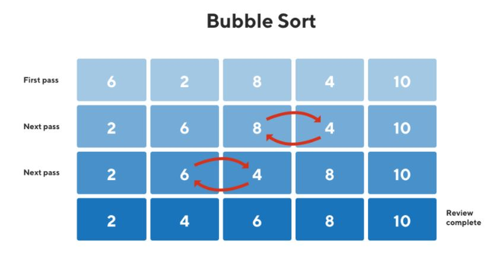

# Approach

## Main Logic

```python
for i in range(n - 1):
    for j in range(n - i - 1):
        if arr[j] > arr[j + 1]:
            arr[j], arr[j + 1] = arr[j + 1], arr[j]
```

- Compare every pair of adjacent elements.
- If they are in the wrong order, swap them.
- After every pass, the largest unsorted element moves to its correct position at the end.
- Repeat until the entire array is sorted.

**Remember:** After every pass, one largest element gets fixed at the end of the array.

---

## Flow



---

## Dry Run

### Example 1

**Input**

```text
arr = [6, 2, 8, 4, 10]
```

| Pass | Comparisons & Swaps | Array After Pass |
|------|----------------------|------------------|
| Initial | - | `[6, 2, 8, 4, 10]` |
| 1 | `6 ↔ 2`, `6 < 8` ✓, `8 ↔ 4`, `8 < 10` ✓ | `[2, 6, 4, 8, 10]` |
| 2 | `2 < 6` ✓, `6 ↔ 4`, `6 < 8` ✓ | `[2, 4, 6, 8, 10]` |
| 3 | `2 < 4` ✓, `4 < 6` ✓ | `[2, 4, 6, 8, 10]` |
| 4 | `2 < 4` ✓ | `[2, 4, 6, 8, 10]` |

**Output**

```text
[2, 4, 6, 8, 10]
```

---

### Example 2 (Sample Input 2 - Test Case 1)

**Input**

```text
arr = [1, 2]
```

| Pass | Comparisons & Swaps | Array After Pass |
|------|----------------------|------------------|
| Initial | - | `[1, 2]` |
| 1 | `1 < 2` ✓ | `[1, 2]` |

**Output**

```text
[1, 2]
```

---

### Example 3 (Sample Input 2 - Test Case 2)

**Input**

```text
arr = [4, 3, 2, 1]
```

| Pass | Comparisons & Swaps | Array After Pass |
|------|----------------------|------------------|
| Initial | - | `[4, 3, 2, 1]` |
| 1 | `4 ↔ 3`, `4 ↔ 2`, `4 ↔ 1` | `[3, 2, 1, 4]` |
| 2 | `3 ↔ 2`, `3 ↔ 1` | `[2, 1, 3, 4]` |
| 3 | `2 ↔ 1` | `[1, 2, 3, 4]` |

**Output**

```text
[1, 2, 3, 4]
```

---

## Complexity Analysis

- **Time Complexity:** `O(n²)` - In the worst case, every pass compares adjacent elements throughout the unsorted part of the array.
- **Space Complexity:** `O(1)` - Sorting is performed in-place without using extra space.