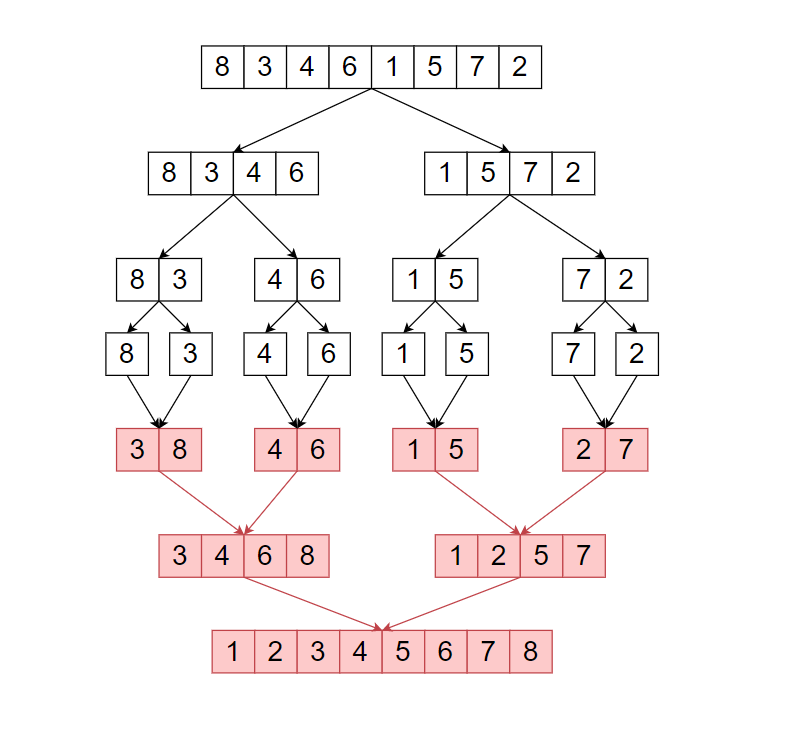

# Approach

## Main Logic

```python
if arr[i] <= arr[j]:
    temp.append(arr[i])
    i += 1
else:
    temp.append(arr[j])
    j += 1
```

- Split the array into two halves using `mid`. Keep splitting until each half has just one element (a single element is already sorted).
- Merge the two sorted halves using two pointers, `i` for the left half and `j` for the right half.
- Compare the elements at `i` and `j`. Take the smaller one into `temp`, then move that pointer forward.
- When one side runs out, copy the rest of the other side straight into `temp`, it's already sorted.
- Copy `temp` back into the original array.

**Remember:** Merge Sort keeps splitting until sorting is trivial, then rebuilds the sorted array by merging pairs of already-sorted pieces.

---

## Key Concept

**Divide and Conquer**

- Break a big problem into smaller subproblems of the same type.
- Solve each subproblem on its own, usually with recursion, until it's trivial.
- Combine the solved subproblems into the final answer.

**Merging two sorted arrays**

- Two sorted arrays can be combined into one sorted array in a single pass, no re-sorting needed.
- Walk both arrays with one pointer each. Always take the smaller of the two current elements and move that pointer ahead.
- When one array runs out, copy the rest of the other array as-is, it's already in order.

---

## Flow



---

## Dry Run

### Example 1

**Input**

```text
arr = [3, 4, 1, 6, 2, 5, 7]
```

**Divide Phase**

```text
merge_sort(0,6)
├─ merge_sort(0,3)
│   ├─ merge_sort(0,1)
│   │   ├─ merge_sort(0,0) → [3]
│   │   └─ merge_sort(1,1) → [4]
│   └─ merge_sort(2,3)
│       ├─ merge_sort(2,2) → [1]
│       └─ merge_sort(3,3) → [6]
└─ merge_sort(4,6)
    ├─ merge_sort(4,5)
    │   ├─ merge_sort(4,4) → [2]
    │   └─ merge_sort(5,5) → [5]
    └─ merge_sort(6,6) → [7]
```

**Merge Phase**

| Step | Range | Left | Right | Comparison Trace | Merged Result |
|------|-------|------|-------|-------------------|----------------|
| 1 | (0,1) | [3] | [4] | 3 ≤ 4 → take 3, then flush 4 | [3, 4] |
| 2 | (2,3) | [1] | [6] | 1 ≤ 6 → take 1, then flush 6 | [1, 6] |
| 3 | (0,3) | [3, 4] | [1, 6] | 3 > 1 → take 1; 3 ≤ 6 → take 3; 4 ≤ 6 → take 4; flush 6 | [1, 3, 4, 6] |
| 4 | (4,5) | [2] | [5] | 2 ≤ 5 → take 2, then flush 5 | [2, 5] |
| 5 | (4,6) | [2, 5] | [7] | 2 ≤ 7 → take 2; 5 ≤ 7 → take 5; flush 7 | [2, 5, 7] |
| 6 | (0,6) | [1, 3, 4, 6] | [2, 5, 7] | 1 ≤ 2 → take 1; 3 > 2 → take 2; 3 ≤ 5 → take 3; 4 ≤ 5 → take 4; 6 > 5 → take 5; 6 ≤ 7 → take 6; flush 7 | [1, 2, 3, 4, 5, 6, 7] |

**Output**

```text
[1, 2, 3, 4, 5, 6, 7]
```

---

### Example 2

**Input**

```text
arr = [4, 3, 1, 2]
```

**Divide Phase**

```text
merge_sort(0,3)
├─ merge_sort(0,1)
│   ├─ merge_sort(0,0) → [4]
│   └─ merge_sort(1,1) → [3]
└─ merge_sort(2,3)
    ├─ merge_sort(2,2) → [1]
    └─ merge_sort(3,3) → [2]
```

**Merge Phase**

| Step | Range | Left | Right | Comparison Trace | Merged Result |
|------|-------|------|-------|-------------------|----------------|
| 1 | (0,1) | [4] | [3] | 4 > 3 → take 3, then flush 4 | [3, 4] |
| 2 | (2,3) | [1] | [2] | 1 ≤ 2 → take 1, then flush 2 | [1, 2] |
| 3 | (0,3) | [3, 4] | [1, 2] | 3 > 1 → take 1; 3 > 2 → take 2; flush 3, 4 | [1, 2, 3, 4] |

**Output**

```text
[1, 2, 3, 4]
```

---

### Example 3

**Input**

```text
arr = [5, 4, 6, 7]
```

**Divide Phase**

```text
merge_sort(0,3)
├─ merge_sort(0,1)
│   ├─ merge_sort(0,0) → [5]
│   └─ merge_sort(1,1) → [4]
└─ merge_sort(2,3)
    ├─ merge_sort(2,2) → [6]
    └─ merge_sort(3,3) → [7]
```

**Merge Phase**

| Step | Range | Left | Right | Comparison Trace | Merged Result |
|------|-------|------|-------|-------------------|----------------|
| 1 | (0,1) | [5] | [4] | 5 > 4 → take 4, then flush 5 | [4, 5] |
| 2 | (2,3) | [6] | [7] | 6 ≤ 7 → take 6, then flush 7 | [6, 7] |
| 3 | (0,3) | [4, 5] | [6, 7] | 4 ≤ 6 → take 4; 5 ≤ 6 → take 5; flush 6, 7 | [4, 5, 6, 7] |

**Output**

```text
[4, 5, 6, 7]
```

---

### Example 4

**Input**

```text
arr = [2, 1, 1]
```

**Divide Phase**

```text
merge_sort(0,2)
├─ merge_sort(0,1)
│   ├─ merge_sort(0,0) → [2]
│   └─ merge_sort(1,1) → [1]
└─ merge_sort(2,2) → [1]
```

**Merge Phase**

| Step | Range | Left | Right | Comparison Trace | Merged Result |
|------|-------|------|-------|-------------------|----------------|
| 1 | (0,1) | [2] | [1] | 2 > 1 → take 1, then flush 2 | [1, 2] |
| 2 | (0,2) | [1, 2] | [1] | 1 ≤ 1 → take 1 (from left); 2 > 1 → take 1 (from right); flush 2 | [1, 1, 2] |

**Output**

```text
[1, 1, 2]
```

---

## Complexity Analysis

- **Time Complexity:** `O(n log n)` - the array is split in half at every level, giving `log n` levels, and merging all pieces back together at each level costs `O(n)` total, so `O(n log n)` overall.
- **Space Complexity:** `O(n)` - the `temp` list used during merging needs space proportional to the number of elements being merged.
