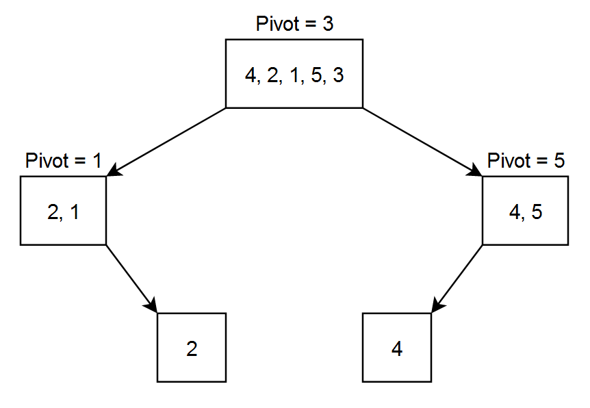

# Approach

## Main Logic

```python
if arr[j] < pivot:
    i += 1
    arr[i], arr[j] = arr[j], arr[i]
```

- Pick the last element of the range as the `pivot`.
- `i` marks the end of the "smaller than pivot" region. It starts one step before the range (`low - 1`).
- `j` scans every element in the range. Each time `arr[j]` is smaller than the pivot, `i` moves forward and swaps with `j`, pulling that element into the smaller region.
- Once `j` finishes scanning, swap the pivot into place right after the smaller region. That's its final sorted spot.
- Recursively sort the left part (`low` to `pivot_index - 1`) and the right part (`pivot_index + 1` to `high`).

**Remember:** After partitioning, the pivot is in its final position, smaller values to its left, larger values to its right. Sorting both sides finishes the job.

---

## Key Concept

**Lomuto Partition Scheme**

- Partitioning rearranges a range around a chosen pivot in one pass: smaller elements end up on its left, larger elements on its right, and the pivot lands right on the border.
- It uses two pointers: `j` visits every element once, and `i` only moves forward when a smaller-than-pivot element is found, marking the end of the "smaller" region.
- Every time `arr[j] < pivot`, that element is swapped into the smaller region (at `i`), growing it by one.
- After the scan, one final swap drops the pivot right after the smaller region, fixing its sorted spot.
- This is done in-place, no extra array is needed, unlike merging two sorted arrays in Merge Sort.

---

## Flow



---

## Dry Run

### Example 1

**Input**

```text
arr = [4, 2, 5, 1, 3]
```

| Call | Range | Pivot | Array After | Pivot Index |
|------|-------|-------|--------------|--------------|
| quick_sort(0,4) | [4,2,5,1,3] | 3 | [2,1,3,4,5] | 2 |
| quick_sort(0,1) | [2,1] | 1 | [1,2,3,4,5] | 0 |
| quick_sort(0,-1) | empty | - | [1,2,3,4,5] | base case, return |
| quick_sort(1,1) | [2] | - | [1,2,3,4,5] | base case, return |
| quick_sort(3,4) | [4,5] | 5 | [1,2,3,4,5] | 4 |
| quick_sort(3,3) | [4] | - | [1,2,3,4,5] | base case, return |
| quick_sort(5,4) | empty | - | [1,2,3,4,5] | base case, return |

**Partitioning steps**

`quick_sort(0,4)` pivot `3`
- `4 < 3` ✗
- `2 < 3` ✓ → swap(0,1)
- `5 < 3` ✗
- `1 < 3` ✓ → swap(1,3)
- end of scan → swap(2,4) places pivot

`quick_sort(0,1)` pivot `1`
- `2 < 1` ✗
- end of scan → swap(0,1) places pivot

`quick_sort(3,4)` pivot `5`
- `4 < 5` ✓ → swap(3,3), same index so no visible change
- end of scan → swap(4,4), same index so no visible change

**Output**

```text
[1, 2, 3, 4, 5]
```

---

### Example 2

**Input**

```text
arr = [6, 2, 4, 1]
```

| Call | Range | Pivot | Array After | Pivot Index |
|------|-------|-------|--------------|--------------|
| quick_sort(0,3) | [6,2,4,1] | 1 | [1,2,4,6] | 0 |
| quick_sort(0,-1) | empty | - | [1,2,4,6] | base case, return |
| quick_sort(1,3) | [2,4,6] | 6 | [1,2,4,6] | 3 |
| quick_sort(1,2) | [2,4] | 4 | [1,2,4,6] | 2 |
| quick_sort(1,1) | [2] | - | [1,2,4,6] | base case, return |
| quick_sort(3,2) | empty | - | [1,2,4,6] | base case, return |
| quick_sort(4,3) | empty | - | [1,2,4,6] | base case, return |

**Partitioning steps**

`quick_sort(0,3)` pivot `1`
- `6 < 1` ✗
- `2 < 1` ✗
- `4 < 1` ✗
- end of scan → swap(0,3) places pivot

`quick_sort(1,3)` pivot `6`
- `2 < 6` ✓ → swap(1,1), same index so no visible change
- `4 < 6` ✓ → swap(2,2), same index so no visible change
- end of scan → swap(3,3), same index so no visible change

`quick_sort(1,2)` pivot `4`
- `2 < 4` ✓ → swap(1,1), same index so no visible change
- end of scan → swap(2,2), same index so no visible change

**Output**

```text
[1, 2, 4, 6]
```

---

### Example 3

**Input**

```text
arr = [5, 3, 2, 6, 4]
```

| Call | Range | Pivot | Array After | Pivot Index |
|------|-------|-------|--------------|--------------|
| quick_sort(0,4) | [5,3,2,6,4] | 4 | [3,2,4,6,5] | 2 |
| quick_sort(0,1) | [3,2] | 2 | [2,3,4,6,5] | 0 |
| quick_sort(0,-1) | empty | - | [2,3,4,6,5] | base case, return |
| quick_sort(1,1) | [3] | - | [2,3,4,6,5] | base case, return |
| quick_sort(3,4) | [6,5] | 5 | [2,3,4,5,6] | 3 |
| quick_sort(3,2) | empty | - | [2,3,4,5,6] | base case, return |
| quick_sort(4,4) | [6] | - | [2,3,4,5,6] | base case, return |

**Partitioning steps**

`quick_sort(0,4)` pivot `4`
- `5 < 4` ✗
- `3 < 4` ✓ → swap(0,1)
- `2 < 4` ✓ → swap(1,2)
- `6 < 4` ✗
- end of scan → swap(2,4) places pivot

`quick_sort(0,1)` pivot `2`
- `3 < 2` ✗
- end of scan → swap(0,1) places pivot

`quick_sort(3,4)` pivot `5`
- `6 < 5` ✗
- end of scan → swap(3,4) places pivot

**Output**

```text
[2, 3, 4, 5, 6]
```

---

### Example 4

**Input**

```text
arr = [1, 2, 3, 4]
```

| Call | Range | Pivot | Array After | Pivot Index |
|------|-------|-------|--------------|--------------|
| quick_sort(0,3) | [1,2,3,4] | 4 | [1,2,3,4] | 3 |
| quick_sort(0,2) | [1,2,3] | 3 | [1,2,3,4] | 2 |
| quick_sort(0,1) | [1,2] | 2 | [1,2,3,4] | 1 |
| quick_sort(0,0) | [1] | - | [1,2,3,4] | base case, return |
| quick_sort(2,1) | empty | - | [1,2,3,4] | base case, return |
| quick_sort(3,2) | empty | - | [1,2,3,4] | base case, return |
| quick_sort(4,3) | empty | - | [1,2,3,4] | base case, return |

**Partitioning steps**

`quick_sort(0,3)` pivot `4`
- `1 < 4` ✓ → swap(0,0), same index so no visible change
- `2 < 4` ✓ → swap(1,1), same index so no visible change
- `3 < 4` ✓ → swap(2,2), same index so no visible change
- end of scan → swap(3,3), same index so no visible change

`quick_sort(0,2)` pivot `3`
- `1 < 3` ✓ → swap(0,0), same index so no visible change
- `2 < 3` ✓ → swap(1,1), same index so no visible change
- end of scan → swap(2,2), same index so no visible change

`quick_sort(0,1)` pivot `2`
- `1 < 2` ✓ → swap(0,0), same index so no visible change
- end of scan → swap(1,1), same index so no visible change

**Output**

```text
[1, 2, 3, 4]
```

---

## Complexity Analysis

- **Time Complexity:** `O(n log n)` average case - a good pivot splits the array into two roughly equal halves each time, giving `log n` levels with `O(n)` partitioning work per level. Worst case is `O(n²)` when the array is already sorted (or reverse sorted), since the last-element pivot then always splits off just one element.
- **Space Complexity:** `O(log n)` average case - partitioning happens in-place, so the only extra space is the recursion stack, which grows with the depth of balanced splits. Worst case is `O(n)` when splits are unbalanced.
