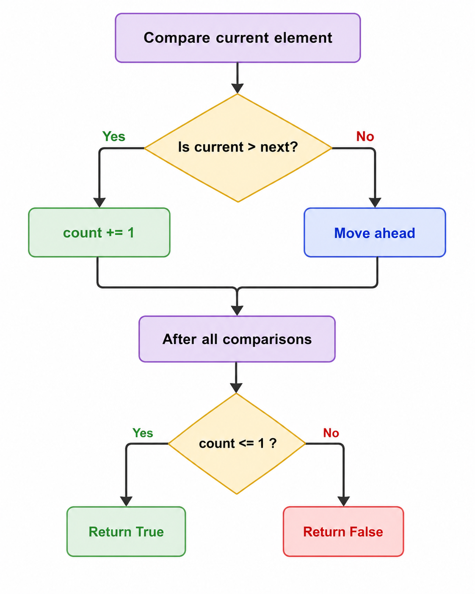

# Approach

## Main Logic

```python
count = 0

if nums[i] > nums[(i + 1) % n]:
    count += 1
```

- In a sorted array, every element is **less than or equal to** the next element.
- After rotation, there can be **only one place** where a larger element is followed by a smaller one.
- Count how many such places exist.
- We use `(i + 1) % n` so that the last element is also compared with the first element.
- If the count is **0 or 1**, the array is sorted and rotated. Otherwise, it is not.

**Remember:** A sorted and rotated array can have **at most one drop** (where `current > next`).

---

## Flow



---

## Dry Run

### Example 1

**Input:** `nums = [3,4,5,1,2]`

| Step | Comparison | Drop? | Count |
|------|------------|-------|------:|
| 1 | `3 > 4` | No | 0 |
| 2 | `4 > 5` | No | 0 |
| 3 | `5 > 1` | Yes | 1 |
| 4 | `1 > 2` | No | 1 |
| 5 | `2 > 3` *(last with first)* | No | 1 |

`count = 1` ≤ 1

**Answer:** `True`

---

### Example 2

**Input:** `nums = [2,1,3,4]`

| Step | Comparison | Drop? | Count |
|------|------------|-------|------:|
| 1 | `2 > 1` | Yes | 1 |
| 2 | `1 > 3` | No | 1 |
| 3 | `3 > 4` | No | 1 |
| 4 | `4 > 2` *(last with first)* | Yes | 2 |

`count = 2` > 1

**Answer:** `False`

---

### Example 3

**Input:** `nums = [1,2,3]`

| Step | Comparison | Drop? | Count |
|------|------------|-------|------:|
| 1 | `1 > 2` | No | 0 |
| 2 | `2 > 3` | No | 0 |
| 3 | `3 > 1` *(last with first)* | Yes | 1 |

`count = 1` ≤ 1

**Answer:** `True`

---

## Complexity Analysis

- **Time Complexity:** `O(n)` - We traverse the array only once.
- **Space Complexity:** `O(1)` - Only one extra variable (`count`) is used.