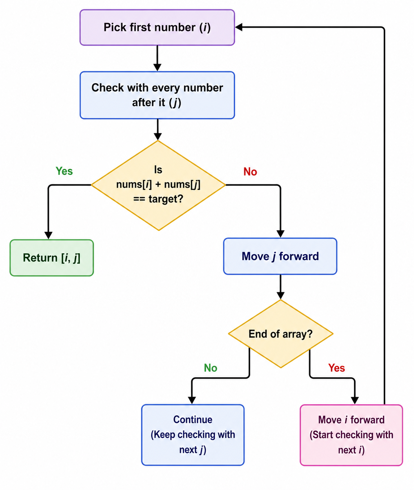

# Approach

## Main Logic

```python
if nums[i] + nums[j] == target:
    return [i, j]
```

- Pick one number using `i`.
- Check it with every number after it using `j`.
- If their sum equals the target, return their indices immediately.
- `j` starts from `i + 1` so the same element is never used twice.

**Remember:** Compare every unique pair until you find the pair whose sum equals the target.

---

## Flow



---

## Dry Run

### Example 1

**Input:** `nums = [2,7,11,15]`, `target = 9`

| `i` | `j` | Pair | Sum | Matches Target? |
|:---:|:---:|:----:|:---:|:---------------:|
| 0 | 1 | `(2, 7)` | 9 | ✅ Yes |

Return:

```text
[0, 1]
```

---

### Example 2

**Input:** `nums = [3,2,4]`, `target = 6`

| `i` | `j` | Pair | Sum | Matches Target? |
|:---:|:---:|:----:|:---:|:---------------:|
| 0 | 1 | `(3, 2)` | 5 | ❌ No |
| 0 | 2 | `(3, 4)` | 7 | ❌ No |
| 1 | 2 | `(2, 4)` | 6 | ✅ Yes |

Return:

```text
[1, 2]
```

---

### Example 3

**Input:** `nums = [3,3]`, `target = 6`

| `i` | `j` | Pair | Sum | Matches Target? |
|:---:|:---:|:----:|:---:|:---------------:|
| 0 | 1 | `(3, 3)` | 6 | ✅ Yes |

Return:

```text
[0, 1]
```

---

## Complexity Analysis

- **Time Complexity:** `O(n²)` – In the worst case, every pair of elements is checked.
- **Space Complexity:** `O(1)` – No extra data structure is used.