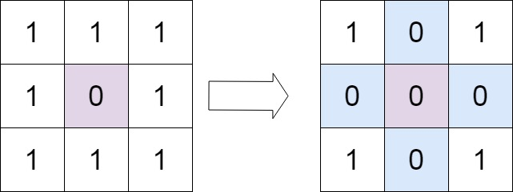
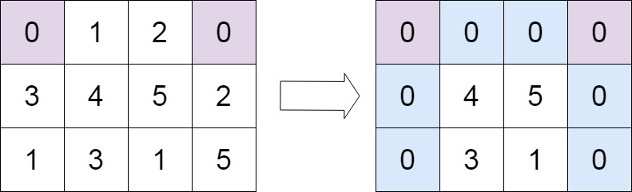

# 7. Set Matrix Zeroes

Source: `07-Arrays/25-Set-Matrix-Zeroes`

## Question

https://leetcode.com/problems/set-matrix-zeroes

Given an `m x n` integer matrix `matrix`, if an element is `0`, set its entire row and column to `0`'s.

You must do it **in place**.

### Example 1



**Input:** `matrix = [[1,1,1],[1,0,1],[1,1,1]]`

**Output:** `[[1,0,1],[0,0,0],[1,0,1]]`

### Example 2



**Input:** `matrix = [[0,1,2,0],[3,4,5,2],[1,3,1,5]]`

**Output:** `[[0,0,0,0],[0,4,5,0],[0,3,1,0]]`

### Constraints

- `m == matrix.length`
- `n == matrix[0].length`
- `1 <= m, n <= 200`
- `-2^31 <= matrix[i][j] <= 2^31 - 1`

## Solution

```python
from typing import List

class Solution:
    def setZeroes(self, matrix: List[List[int]]) -> None:
        rows = len(matrix)
        cols = len(matrix[0])

        col0 = 1

        for i in range(rows):
            if matrix[i][0] == 0:
                col0 = 0

            for j in range(1, cols):
                if matrix[i][j] == 0:
                    matrix[i][0] = 0
                    matrix[0][j] = 0

        for i in range(rows - 1, -1, -1):
            for j in range(cols - 1, 0, -1):
                if matrix[i][0] == 0 or matrix[0][j] == 0:
                    matrix[i][j] = 0

            if col0 == 0:
                matrix[i][0] = 0

        return matrix

if __name__ == "__main__":
    n = int(input("Enter number of rows: "))
    matrix_input = [list(map(int, input().split())) for _ in range(n)]
    print(Solution().setZeroes(matrix_input))
```

## Approach

### Main Logic

```python
if matrix[i][j] == 0:
    matrix[i][0] = 0
    matrix[0][j] = 0
```

```python
if matrix[i][0] == 0 or matrix[0][j] == 0:
    matrix[i][j] = 0
```

- First pass: scan every cell except column `0`. Whenever a zero is found at `(i, j)`, mark it by zeroing `matrix[i][0]` (this row has a zero) and `matrix[0][j]` (this column has a zero). A separate `col0` variable tracks whether column `0` itself originally had a zero, since `matrix[0][0]` alone can't represent both row `0`'s and column `0`'s status at once.
- Second pass: walk the matrix again (skipping row `0` and column `0`), and zero out any cell whose row-marker or column-marker says to.
- Row `0` and column `0` are updated last, using the saved markers, so their original data isn't wiped out before it's been read by every other cell.
- The pass order matters: going through rows bottom-to-top and columns right-to-left means the marker cells (`matrix[i][0]` and `matrix[0][j]`) are always read before they get overwritten.

**Remember:** Use the matrix's own first row and column as marker cells instead of extra arrays. Mark first, zero later, and save column `0`'s status separately since the corner cell can't hold two markers at once.

---

### Key Concept

**In-place Marking with the Matrix Itself**

- Normally, remembering "which rows have a zero" and "which columns have a zero" needs two separate arrays, that's `O(m + n)` extra space.
- The trick: the matrix already has a first row and a first column. Reuse those actual cells as the marker arrays instead of allocating new ones, `matrix[0][j]` doubles as "does column `j` have a zero", `matrix[i][0]` doubles as "does row `i` have a zero".
- The only conflict is cell `matrix[0][0]`, it would need to mark both "row `0` has a zero" and "column `0` has a zero" at the same time. A single extra variable (`col0`) resolves that by tracking column `0`'s status separately, leaving `matrix[0][0]` free to represent row `0`.
- This turns what would need extra space into a constant-space solution, since the matrix itself stores all the bookkeeping.

---

### Dry Run

#### Example 1

**Input**

```text
matrix = [
  [1, 1, 1],
  [1, 0, 1],
  [1, 1, 1]
]
```

**Pass 1: marking** (`col0` starts at `1`)

| i | matrix[i][0] == 0? | col0 | j checked | matrix[i][j] | Action |
|---|---------------------|------|-----------|--------------|--------|
| 0 | No | 1 | 1, 2 | 1, 1 | no zero found, no marks |
| 1 | No | 1 | 1 | 0 | zero found → matrix[1][0] = 0, matrix[0][1] = 0 |
| 1 | | | 2 | 1 | no zero found |
| 2 | No | 1 | 1, 2 | 1, 1 | no zero found, no marks |

Matrix after pass 1:

```text
[1, 0, 1]
[0, 0, 1]
[1, 1, 1]
```

**Pass 2: zeroing** (walking `i` from `2` down to `0`, `j` from `2` down to `1`)

| i | j | matrix[i][0] | matrix[0][j] | Decision |
|---|---|--------------|--------------|----------|
| 2 | 2 | 1 | 1 | both nonzero → matrix[2][2] stays 1 |
| 2 | 1 | 1 | 0 | matrix[0][1] = 0 → matrix[2][1] = 0 |
| — | — | | | col0 = 1, so matrix[2][0] stays 1 |
| 1 | 2 | 0 | 1 | matrix[1][0] = 0 → matrix[1][2] = 0 |
| 1 | 1 | 0 | 0 | matrix[1][0] = 0 → matrix[1][1] = 0 |
| — | — | | | col0 = 1, so matrix[1][0] stays 0 (already the marker value) |
| 0 | 2 | 1 | 1 | both nonzero → matrix[0][2] stays 1 |
| 0 | 1 | 1 | 0 | matrix[0][1] = 0 → matrix[0][1] = 0 (already 0) |
| — | — | | | col0 = 1, so matrix[0][0] stays 1 |

**Output**

```text
[[1, 0, 1], [0, 0, 0], [1, 0, 1]]
```

---

#### Example 2

**Input**

```text
matrix = [
  [0, 1, 2, 0],
  [3, 4, 5, 2],
  [1, 3, 1, 5]
]
```

**Pass 1: marking** (`col0` starts at `1`)

| i | matrix[i][0] == 0? | col0 | j checked | matrix[i][j] | Action |
|---|---------------------|------|-----------|--------------|--------|
| 0 | Yes → col0 = 0 | 0 | 1, 2 | 1, 2 | no zero found |
| 0 | | | 3 | 0 | zero found → matrix[0][0] = 0 (already 0), matrix[0][3] = 0 (already 0) |
| 1 | No | 0 | 1, 2, 3 | 4, 5, 2 | no zero found |
| 2 | No | 0 | 1, 2, 3 | 3, 1, 5 | no zero found |

Matrix after pass 1 is unchanged from the input, since every mark this time was on a cell that was already `0`. Markers say: row `0` has a zero (`matrix[0][0] = 0`), column `3` has a zero (`matrix[0][3] = 0`), columns `1` and `2` don't, and `col0 = 0` means column `0` has a zero too.

**Pass 2: zeroing** (walking `i` from `2` down to `0`, `j` from `3` down to `1`)

| i | j | matrix[i][0] | matrix[0][j] | Decision |
|---|---|--------------|--------------|----------|
| 2 | 3 | 1 | 0 | matrix[0][3] = 0 → matrix[2][3] = 0 |
| 2 | 2 | 1 | 2 | both nonzero → matrix[2][2] stays 1 |
| 2 | 1 | 1 | 1 | both nonzero → matrix[2][1] stays 3 |
| — | — | | | col0 = 0 → matrix[2][0] = 0 |
| 1 | 3 | 3 | 0 | matrix[0][3] = 0 → matrix[1][3] = 0 |
| 1 | 2 | 3 | 2 | both nonzero → matrix[1][2] stays 5 |
| 1 | 1 | 3 | 1 | both nonzero → matrix[1][1] stays 4 |
| — | — | | | col0 = 0 → matrix[1][0] = 0 |
| 0 | 3 | 0 | 0 | matrix[i][0] = 0 → matrix[0][3] = 0 (already 0) |
| 0 | 2 | 0 | 2 | matrix[i][0] = 0 → matrix[0][2] = 0 |
| 0 | 1 | 0 | 1 | matrix[i][0] = 0 → matrix[0][1] = 0 |
| — | — | | | col0 = 0 → matrix[0][0] = 0 (already 0) |

**Output**

```text
[[0, 0, 0, 0], [0, 4, 5, 0], [0, 3, 1, 0]]
```

---

### Complexity Analysis

- **Time Complexity:** `O(m * n)` - the matrix is scanned twice, once to mark and once to zero, both proportional to the total number of cells.
- **Space Complexity:** `O(1)` - only the matrix's own first row and column, plus one `col0` variable, are used as markers, no extra data structure grows with input size.
