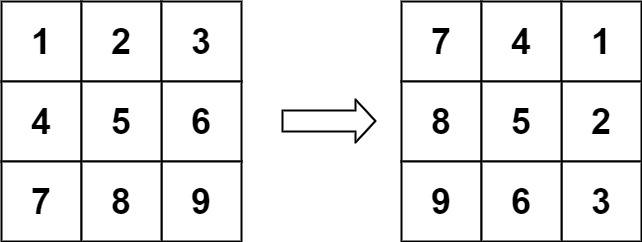
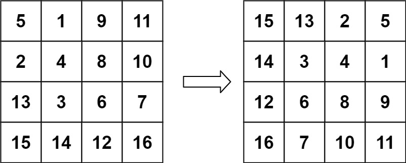

# 8. Rotate Matrix by 90 Degrees

Source: `07-Arrays/26-Rotate-Image`

## Question

https://leetcode.com/problems/rotate-image

You are given an `n x n` 2D `matrix` representing an image, rotate the image by 90 degrees (clockwise).

You have to rotate the image **in-place**, which means you have to modify the input 2D matrix directly. **DO NOT** allocate another 2D matrix and do the rotation.

### Example 1



**Input:** `matrix = [[1,2,3],[4,5,6],[7,8,9]]`

**Output:** `[[7,4,1],[8,5,2],[9,6,3]]`

### Example 2



**Input:** `matrix = [[5,1,9,11],[2,4,8,10],[13,3,6,7],[15,14,12,16]]`

**Output:** `[[15,13,2,5],[14,3,4,1],[12,6,8,9],[16,7,10,11]]`

### Constraints

- `n == matrix.length == matrix[i].length`
- `1 <= n <= 20`
- `-1000 <= matrix[i][j] <= 1000`

## Solution

```python
from typing import List

class Solution:
    def rotate(self, matrix: List[List[int]]) -> None:
        n = len(matrix)

        for i in range(n):
            for j in range(i + 1, n):
                matrix[i][j], matrix[j][i] = matrix[j][i], matrix[i][j]

        for i in range(n):
            left = 0
            right = n - 1

            while left < right:
                matrix[i][left], matrix[i][right] = matrix[i][right], matrix[i][left]

                left += 1
                right -= 1

        return matrix

if __name__ == "__main__":
    n_input = int(input("Enter number of rows: "))
    matrix_input = [list(map(int, input().split())) for _ in range(n_input)]
    print(Solution().rotate(matrix_input))
```

## Approach

### Main Logic

```python
matrix[i][j], matrix[j][i] = matrix[j][i], matrix[i][j]
```

```python
matrix[i][left], matrix[i][right] = matrix[i][right], matrix[i][left]
```

- Step 1: transpose the matrix in place. For every cell above the diagonal (`j > i`), swap `matrix[i][j]` with `matrix[j][i]`. This flips the matrix across its main diagonal, turning rows into columns.
- Step 2: reverse every row left-to-right, using two pointers that start at the row's ends and move toward the middle, swapping as they go.
- Doing the transpose first and the row reversal second produces a 90 degree clockwise rotation, all without allocating a second matrix.

**Remember:** Transpose the matrix, then reverse each row. That combination is exactly a 90 degree clockwise rotation.

---

### Key Concept

**Transpose + Reverse Rows = 90 Degree Clockwise Rotation**

- Rotating a matrix 90 degrees clockwise moves the element at `(i, j)` to `(j, n - 1 - i)`.
- A transpose alone (swapping `matrix[i][j]` with `matrix[j][i]`) is a reflection across the main diagonal, it's not a rotation by itself.
- Reversing each row left-to-right is a reflection across the vertical middle of the matrix.
- Two reflections done back to back, diagonal first and then vertical, land every element exactly where a 90 degree clockwise rotation would. This transpose-then-reverse combo is the standard trick for rotating a matrix in place without extra space.

---

### Dry Run

#### Example 1

**Input**

```text
matrix = [
  [1, 2, 3],
  [4, 5, 6],
  [7, 8, 9]
]
```

**Step 1: transpose** (swap `matrix[i][j]` with `matrix[j][i]` for `j > i`)

| i | j | Swap | Result |
|---|---|------|--------|
| 0 | 1 | matrix[0][1] ↔ matrix[1][0] | 2 ↔ 4 |
| 0 | 2 | matrix[0][2] ↔ matrix[2][0] | 3 ↔ 7 |
| 1 | 2 | matrix[1][2] ↔ matrix[2][1] | 6 ↔ 8 |

Matrix after transpose:

```text
[1, 4, 7]
[2, 5, 8]
[3, 6, 9]
```

**Step 2: reverse each row**

| Row | Before | left, right swap | After |
|-----|--------|-------------------|-------|
| 0 | [1, 4, 7] | swap index 0 and 2 → 1 ↔ 7 | [7, 4, 1] |
| 1 | [2, 5, 8] | swap index 0 and 2 → 2 ↔ 8 | [8, 5, 2] |
| 2 | [3, 6, 9] | swap index 0 and 2 → 3 ↔ 9 | [9, 6, 3] |

**Output**

```text
[[7, 4, 1], [8, 5, 2], [9, 6, 3]]
```

---

#### Example 2

**Input**

```text
matrix = [
  [5, 1, 9, 11],
  [2, 4, 8, 10],
  [13, 3, 6, 7],
  [15, 14, 12, 16]
]
```

**Step 1: transpose** (swap `matrix[i][j]` with `matrix[j][i]` for `j > i`)

| i | j | Swap | Result |
|---|---|------|--------|
| 0 | 1 | matrix[0][1] ↔ matrix[1][0] | 1 ↔ 2 |
| 0 | 2 | matrix[0][2] ↔ matrix[2][0] | 9 ↔ 13 |
| 0 | 3 | matrix[0][3] ↔ matrix[3][0] | 11 ↔ 15 |
| 1 | 2 | matrix[1][2] ↔ matrix[2][1] | 8 ↔ 3 |
| 1 | 3 | matrix[1][3] ↔ matrix[3][1] | 10 ↔ 14 |
| 2 | 3 | matrix[2][3] ↔ matrix[3][2] | 7 ↔ 12 |

Matrix after transpose:

```text
[5, 2, 13, 15]
[1, 4, 3, 14]
[9, 8, 6, 12]
[11, 10, 7, 16]
```

**Step 2: reverse each row**

| Row | Before | left, right swaps | After |
|-----|--------|--------------------|-------|
| 0 | [5, 2, 13, 15] | swap index 0,3 → 5 ↔ 15; swap index 1,2 → 2 ↔ 13 | [15, 13, 2, 5] |
| 1 | [1, 4, 3, 14] | swap index 0,3 → 1 ↔ 14; swap index 1,2 → 4 ↔ 3 | [14, 3, 4, 1] |
| 2 | [9, 8, 6, 12] | swap index 0,3 → 9 ↔ 12; swap index 1,2 → 8 ↔ 6 | [12, 6, 8, 9] |
| 3 | [11, 10, 7, 16] | swap index 0,3 → 11 ↔ 16; swap index 1,2 → 10 ↔ 7 | [16, 7, 10, 11] |

**Output**

```text
[[15, 13, 2, 5], [14, 3, 4, 1], [12, 6, 8, 9], [16, 7, 10, 11]]
```

---

### Complexity Analysis

- **Time Complexity:** `O(n^2)` - the transpose visits roughly half the cells and the row reversal visits every cell once, both proportional to the total number of cells.
- **Space Complexity:** `O(1)` - the matrix is rotated in place using only a few pointer variables, no extra matrix is allocated.
