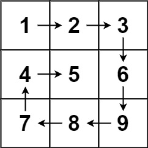
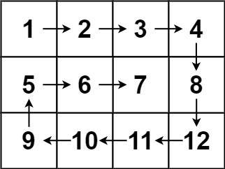

# 9. Print the Matrix in Spiral Manner

Source: `07-Arrays/27-Spiral-Matrix`

## Question

https://leetcode.com/problems/spiral-matrix

## Spiral Matrix

Given an `m x n` `matrix`, return all elements of the `matrix` in spiral order.

### Example 1



**Input:** `matrix = [[1,2,3],[4,5,6],[7,8,9]]`  
**Output:** `[1,2,3,6,9,8,7,4,5]`

### Example 2



**Input:** `matrix = [[1,2,3,4],[5,6,7,8],[9,10,11,12]]`  
**Output:** `[1,2,3,4,8,12,11,10,9,5,6,7]`

## Solution

```python
from typing import List

class Solution:
    def spiralOrder(self, matrix: List[List[int]]) -> List[int]:
        rows = len(matrix)
        cols = len(matrix[0])

        top = 0
        bottom = rows - 1
        left = 0
        right = cols - 1

        ans = []

        while left <= right and top <= bottom:
            for col in range(left, right + 1):
                ans.append(matrix[top][col])
            top += 1

            for row in range(top, bottom + 1):
                ans.append(matrix[row][right])
            right -= 1

            if top <= bottom:
                for col in range(right, left - 1, -1):
                    ans.append(matrix[bottom][col])
                bottom -= 1

            if left <= right:
                for row in range(bottom, top - 1, -1):
                    ans.append(matrix[row][left])
                left += 1

        return ans

if __name__ == "__main__":
    rows_input, cols_input = map(int, input().split())
    matrix_input = [list(map(int, input().split())) for _ in range(rows_input)]
    print(Solution().spiralOrder(matrix_input))
```

## Approach

### Main Logic

```python
for col in range(left, right + 1):
    ans.append(matrix[top][col])
top += 1

for row in range(top, bottom + 1):
    ans.append(matrix[row][right])
right -= 1

if top <= bottom:
    for col in range(right, left - 1, -1):
        ans.append(matrix[bottom][col])
    bottom -= 1

if left <= right:
    for row in range(bottom, top - 1, -1):
        ans.append(matrix[row][left])
    left += 1
```

- Walk the top row from `left` to `right`, then move the `top` boundary down by one.
- Walk the right column from `top` to `bottom`, then move the `right` boundary left by one.
- If there are still rows left (`top <= bottom`), walk the bottom row from `right` to `left`, then move the `bottom` boundary up by one.
- If there are still columns left (`left <= right`), walk the left column from `bottom` to `top`, then move the `left` boundary right by one.
- Repeat this whole block for the next inner layer, until the boundaries cross.

**Remember:** One spiral layer is just four straight walks, top row, right column, bottom row, left column, and each walk shrinks the boundary it just used.

---

### Key Concept

#### Four Boundary Pointers (Layer by Layer)

- Property: instead of tracking one row or column position, keep four boundaries, `top`, `bottom`, `left`, `right`. Each one marks the edge of the region that hasn't been visited yet.
- Why it works: once a full side has been walked, that side is done, so its boundary moves inward by one. When all four boundaries cross each other, every element has been visited exactly once.
- The two `if` checks matter because after walking the top row and right column, the remaining region can shrink down to a single row or a single column. Without those checks, that row or column would get walked twice.

**Remember:** Think of the matrix as layers, like an onion. One pass around all four boundaries peels off a single outer layer.

---

### Flow

```text
One layer:

  Right along the top row  →
  ↓
  Down along the right column
  ↓
  ← Left along the bottom row (if a row remains)
  ↓
  Up along the left column (if a column remains)
  ↓
  Boundaries shrink inward, repeat for the next layer
```

---

### Dry Run

#### Example 1

**Input:** `matrix = [[1,2,3],[4,5,6],[7,8,9]]`

Initial: `top=0, bottom=2, left=0, right=2, ans=[]`

| Layer | Side | Action | ans (after) | top | bottom | left | right |
|:-----:|------|--------|--------------|:---:|:------:|:----:|:-----:|
| 1 | Top row | Walk row 0, col 0 to 2 → append `1,2,3` | `[1,2,3]` | 1 | 2 | 0 | 2 |
| 1 | Right col | Walk col 2, row 1 to 2 → append `6,9` | `[1,2,3,6,9]` | 1 | 2 | 0 | 1 |
| 1 | Bottom row | `top(1) <= bottom(2)`, walk row 2, col 1 to 0 → append `8,7` | `[1,2,3,6,9,8,7]` | 1 | 1 | 0 | 1 |
| 1 | Left col | `left(0) <= right(1)`, walk col 0, row 1 to 1 → append `4` | `[1,2,3,6,9,8,7,4]` | 1 | 1 | 1 | 1 |
| 2 | Top row | Walk row 1, col 1 to 1 → append `5` | `[1,2,3,6,9,8,7,4,5]` | 2 | 1 | 1 | 1 |
| 2 | Right col | Range is empty, nothing to walk | (no change) | 2 | 1 | 1 | 0 |
| 2 | Bottom row | `top(2) <= bottom(1)` is false → skip | (no change) | 2 | 1 | 1 | 0 |
| 2 | Left col | `left(1) <= right(0)` is false → skip | (no change) | 2 | 1 | 1 | 0 |

Loop check: `left(1) <= right(0)` is false, so the loop stops.

**Output:** `[1,2,3,6,9,8,7,4,5]`

---

#### Example 2

**Input:** `matrix = [[1,2,3,4],[5,6,7,8],[9,10,11,12]]`

Initial: `top=0, bottom=2, left=0, right=3, ans=[]`

| Layer | Side | Action | ans (after) | top | bottom | left | right |
|:-----:|------|--------|--------------|:---:|:------:|:----:|:-----:|
| 1 | Top row | Walk row 0, col 0 to 3 → append `1,2,3,4` | `[1,2,3,4]` | 1 | 2 | 0 | 3 |
| 1 | Right col | Walk col 3, row 1 to 2 → append `8,12` | `[1,2,3,4,8,12]` | 1 | 2 | 0 | 2 |
| 1 | Bottom row | `top(1) <= bottom(2)`, walk row 2, col 2 to 0 → append `11,10,9` | `[1,2,3,4,8,12,11,10,9]` | 1 | 1 | 0 | 2 |
| 1 | Left col | `left(0) <= right(2)`, walk col 0, row 1 to 1 → append `5` | `[1,2,3,4,8,12,11,10,9,5]` | 1 | 1 | 1 | 2 |
| 2 | Top row | Walk row 1, col 1 to 2 → append `6,7` | `[1,2,3,4,8,12,11,10,9,5,6,7]` | 2 | 1 | 1 | 2 |
| 2 | Right col | Range is empty, nothing to walk | (no change) | 2 | 1 | 1 | 1 |
| 2 | Bottom row | `top(2) <= bottom(1)` is false → skip | (no change) | 2 | 1 | 1 | 1 |
| 2 | Left col | `left(1) <= right(1)`, but the row range is empty → nothing to walk | (no change) | 2 | 1 | 2 | 1 |

Loop check: `left(2) <= right(1)` is false, so the loop stops.

**Output:** `[1,2,3,4,8,12,11,10,9,5,6,7]`

---

### Complexity Analysis

- **Time Complexity:** `O(m * n)` - Because every element of the matrix is visited exactly once.
- **Space Complexity:** `O(1)` - Extra space, not counting the output list, since only the four boundary variables are used.
